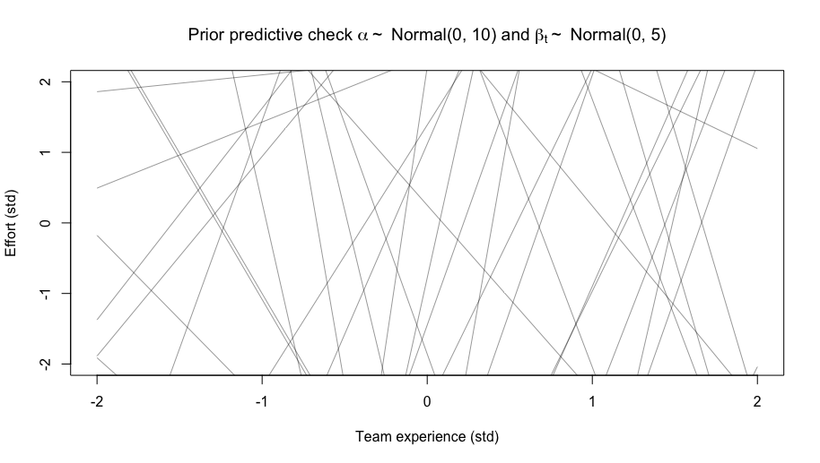

```{r setup, include=FALSE}
knitr::opts_chunk$set(echo = TRUE)
knitr::opts_chunk$set(cache = TRUE)

library(rethinking) # the sw for model specification (it then uses cmdstan)
library(foreign) # need to load funky data format
library(here) # make sure working dir is the same all the time
library(dagitty) # drawing DAGs
library(ggdag) # also a DAG library (all DAG stuff commented out for now)
library(latex2exp)
set.seed(100)
```

## The data and the problem

For this example we'll make use of a dataset found in the PROMISE repository^[http://promise.site.uottawa.ca/SERepository/datasets/desharnais.arff] donated by Prof. Martin Shepperd in 2005, and originally from J.&nbsp;M.&nbsp;Desharnais' master thesis. We would like to predict `Effort` (our outcome) for implementing a software artifact, given programming language, team experience, and manager experience (our predictors).

```{r}
 f <- read.arff("data/desharnais.arff")
 
 # remove columns we don't need
 f <- f[-c(1,4:5,7:11)]

 # remove NAs in the dataset
 f <- f[complete.cases(f), ]
 
 # convert Language (factor) to numeric
 f$Language <- as.numeric(f$Language)

 str(f)
```

So, from the top, we have team (`TeamExp`) and manager (`ManagerExp`) experience in years, `Effort` in hours, and programming `Language` used, here as a factor with three levels. In total we have `r nrow(f)` rows (or observations, if you will).

## Assumptions concerning data generation process

What ontological and epistemological assumptions can we make concerning the underlying process that generated the outcome `Effort`?

### Ontological assumptions

The outcome consists of positive integers, i.e., $\mathbb{N}^+$, so a count going from $0 \rightarrow \infty$. However, `Effort` is also a measurement adding up a lot of fluctuations (i.e., language used, team culture, personalities among staff, etc.), which could indicate another option.

### Epistemological assumptions

From an information theoretical point of view we want to use a likelihood that allows the data to happen in the most ways, i.e., it's doesn't constrain the story data wantS to tell us. Given the above, we basically have two options: $\mathsf{Poisson}(\lambda)$ and $\mathsf{Normal}(\mu,\sigma)$.

Concerning $\mathsf{Poisson}(\lambda)$ there's a requirement that the mean and variance (which the $\lambda$ parameter represents) are equal. This is not the case for the outcome `Effort`,

```{r}
mean(f$Effort)
var(f$Effort)
```

this indicates that the variance needs to be modeled separately. The common way to do this is to use a mixture distribution, i.e., $\mathsf{Negative}\text{-}\mathsf{Binomial}(\lambda, \phi)$ a.k.a. $\mathsf{Gamma}\text{-}\mathsf{Poisson}(\lambda, \phi)$.

The other way would be to assume a $\mathsf{Normal}$ likelihood (a.k.a. $\mathsf{Gaussian}$), but it expects real, $\mathbb{R}$, numbers. This we can, actually, accomodate by standardizing the outcome (i.e., remove the mean from each value and divide by the variable's standard deviation),

```{r}
f$Effort <- scale(f$Effort)
```

> When all we know or are willing to say about a distribution of measures
> (measures are continuous values on the real number line) is their mean and
> variance, then the Gaussian distribution arises as the most consistent with
> our assumptions.
>
> &#8212; Richard McElreath

## Initial models

Let us design four models and see how well they compare concerning out of sample predictions. Except for the first model, do prior and posterior predictive checks.

### $\mathcal{M}_0$

```{r, message=FALSE, warning=FALSE, results='hide'}
m0 <- ulam(
  alist(
    Effort ~ normal(mu, sigma),
    mu <- alpha,
    alpha ~ normal(0, 10),
    sigma ~ exponential(1)
  ), data = f, cores = 4, chains = 4, cmdstan = TRUE, log_lik = TRUE
)
```

### $\mathcal{M}_1$

```{r, message=FALSE, warning=FALSE, results='hide'}
m1 <- ulam(
  alist(
    Effort ~ normal(mu, sigma),
    mu <- alpha + beta_t * TeamExp,
    alpha ~ normal(0, 0.5),
    beta_t ~ normal(0, 0.5),
    sigma ~ exponential(1)
  ), data = f, cores = 4, chains = 4, cmdstan = TRUE, log_lik = TRUE,
  iter = 5e3
)
```

```{r, message=FALSE, warning=FALSE, results='hide'}
prior <- extract.prior(m1) # sample only from priors
mu <- link(m1, post = prior, data = list(TeamExp = c(-2,2)))
```

```{r m1pri, fig.align='center'}
plot(NULL, xlim = c(-2,2), ylim = c(-2,2), 
     main = TeX("Prior predictive check $\\alpha \\sim $Normal$(0, 0.5)$ and $\\beta_t \\sim$Normal$(0, 0.5)$"), 
     xlab = "Team experience (std)", 
     ylab = "Effort (std)")
for(i in 1:50) lines(c(-2,2), mu[i,], col=col.alpha("black",0.4))
```

Compare the above plot to the plot below where we've set $\alpha \sim \mathsf{Normal}(0,10)$ and $\beta_t \sim \mathsf{Normal}(0,5)$, which are common default priors.

```{r, echo=FALSE, out.width="70%", fig.align='center'}

```

The $\widehat{R}$ looks ok (i.e. $<1.01$), and the effective sample size for each parameter is in the thousands.

### $\mathcal{M}_2$

```{r, message=FALSE, warning=FALSE, results='hide'}
m2 <- ulam(
  alist(
    Effort ~ normal(mu, sigma),
    mu <- alpha + beta_t * TeamExp + beta_m * ManagerExp,
    alpha ~ normal(0, 1),
    c(beta_t, beta_m) ~ normal(0, 0.5),
    sigma ~ exponential(1)
  ), data = f, cores = 4, chains = 4, cmdstan = TRUE, log_lik = TRUE,
  iter = 5e3
)
```

```{r, message=FALSE, warning=FALSE, results='hide'}
prior <- extract.prior(m2) # sample only from priors
mu <- link(m2, post = prior, data = list(TeamExp = c(-2,2), 
                                         ManagerExp = c(-2,2)))
```

```{r, fig.align='center'}
plot(NULL, xlim = c(-2,2), ylim = c(-2,2), main = "Prior predictive check", 
     xlab = "Predictors", ylab = "Effort (std)")
for(i in 1:50) lines(c(-2,2), mu[i,], col=col.alpha("black",0.4))
```

### $\mathcal{M}_3$

```{r, message=FALSE, warning=FALSE, results='hide'}
m3 <- ulam(
  alist(
    Effort ~ normal(mu, sigma),
    mu <- a_bar + beta_t * TeamExp + beta_m * ManagerExp + l[Language]*sigma_l,
    c(beta_t, beta_m) ~ normal(0, 0.25),
    l[Language] ~ normal(0, 1),
    a_bar ~ normal(0, 1),
    sigma_l ~ exponential(1),
    sigma ~ exponential(1),
    gq> vector[Language]:a <<- a_bar + l * sigma_l
  ), data = f, cores = 4, chains = 4, cmdstan = TRUE, log_lik = TRUE,
  iter = 5e3, control = list(adapt_delta=0.99)
)
```

```{r, message=FALSE, warning=FALSE, results='hide'}
prior <- extract.prior(m3) # sample only from priors
mu <- link(m3, post = prior, data = list(TeamExp = c(-2,2), 
                                         ManagerExp = c(-2,2),
                                         Language = seq(1:3)))
```

```{r, fig.align='center'}
plot(NULL, xlim = c(-2,2), ylim = c(-2,2), main = "Prior predictive check", 
     xlab = "Predictors", ylab = "Effort (std)")
for(i in 1:50) lines(c(-2,2), mu[i,], col=col.alpha("black",0.4))
```

```{r postcheck, fig.align='center'}
postcheck(m3, window=nrow(f))
```

```{r}
round(precis(m3, depth = 2), 2)
```

## Model comparison

```{r loo, warning=FALSE, message=FALSE, fig.align='center'}
round(compare(m0, m1, m2, m3, func=LOO), 2)
plot(compare(m0, m1, m2, m3, func=LOO), 2)
```


## Estimates for $\mathcal{M}_3$

```{r}
round(precis(m3, prob = 0.95, depth = 2), 2)
```

Concerning our three languages we see that, on the arbitrary 95%-level, Language $3$, i.e., `a[3]` has a negative effect, while the other two languages have no effect. We have an estimate and a credible interval for `a[3]` but how does the posterior probability distributions for all three languages look like?

```{r fig.height=4, fig.width=4, fig.align='center'}
post <- extract.samples(m3)
par(mfrow = c(3,1))
par(mar = c(2, 2, 2, 2))
plot(NULL, xlim = c(-3.5,3.5), ylim = c(0, 2.0), ylab = "Density", xlab = "", 
     xaxt = "n", main = "posterior distributions of Language 1 (top),\n 2 (middle), and 3 (bottom)", bty =  "n")
dens(post$a[,1], add = TRUE)
lines(c(0,0), c(0, 2.0), type = "l", col = alpha("red", 0.7))
axis(side=1, at=c(-3,-2,-1,0,1,2,3))

plot(NULL, xlim = c(-3.5,3.5), ylim = c(0, 2.0), ylab = "Density", xlab = "", 
     xaxt = "n", bty =  "n")
dens(post$a[,2], add = TRUE)
lines(c(0,0), c(0, 2.0), type = "l", col = alpha("red", 0.7))
axis(side=1, at=c(-3,-2,-1,0,1,2,3))

plot(NULL, xlim = c(-3.5,3.5), ylim = c(0, 2.0), ylab = "Density", xlab = "", 
     bty =  "n")
dens(post$a[,3], add = TRUE)
lines(c(0,0), c(0, 2.0), type = "l", col = alpha("red", 0.7))
axis(side=1, at=c(-3,-2,-1,0,1,2,3))
```

## Understanding effects better through simulation

How about "average" language effect (uncertainty is 89% in shaded area)?

```{r, fig.align='center'}
p_link_abar <- function(Language) {
    res <- with(post, a_bar + l[,Language])
    return(res)
}
p_raw <- sapply(1:3, function(i) p_link_abar(i))
p_mu <- apply( p_raw , 2 , mean )
p_ci <- apply( p_raw , 2 , PI )

plot(NULL, xlab = "", 
     ylab = "effect", 
     main = "average language",
     xaxt = "n",
     xlim = c(1,3),
     ylim = c(-2.5,2.5))
axis(1, at = c(1.0, 2.0, 3.0), labels = c("Language 1","Language 2", "Language 3"), font = 2)
lines(1:3, p_mu)
shade(p_ci , 1:3)
```

Marginal effect, i.e., how variable different languages are (89% uncertainty in shaded area).

```{r, fig.align='center'}
a_sim <- with( post , rnorm( length(post$a_bar) , a_bar , sigma_l ) )
p_link_asim <- function( Language ) {
    res <- with( post , a_sim + l[,Language] )
    return(res)
}
p_raw_asim <- sapply( 1:3 , function(i) p_link_asim( i ) )
p_mu <- apply(p_raw_asim, 2, mean)
p_ci <- apply(p_raw_asim, 2, PI)

plot(NULL, xlab = "", 
     ylab = "effect", 
     main = "maginal of language",
     xaxt = "n",
     xlim = c(1, 3),
     ylim = c(-3, 3))
axis(1, at = c(1.0, 2.0, 3.0), labels = c("Language 1","Language 2", "Language 3"), font = 2)
lines(1:3, p_mu)
shade(p_ci , 1:3)
```


Simulated languages, i.e., the effect of language with the variation among team and manager experience.

```{r, fig.align='center'}
plot( NULL , main = "simulated languages", xlab="" , ylab="effect" ,
    ylim=c(-5,5), xaxt="n", xlim=c(1,3))
axis(1, at = c(1.0,2.0,3.0), labels = c("Language 1","Language 2", "Language 3"))
for ( i in 1:50 ) lines( 1:3 , p_raw_asim[i,] , col=grau(0.25) , lwd=2 )
```

How does the language effect look like when we alter **team** experience (min and max values), while keeping manager experience to it's mean ($\mu = 2.6$ years)?

```{r, fig.align='center', fig.height=5, fig.width=5}
d_pred <- data.frame(
    Language = c(1,1), # language 1
    TeamExp = c(-1.5,1.5), # min/max
    ManagerExp = 0 # mean for ManagerExp
)

p <- link(m3, data = d_pred)

p_mu_1 <- apply(p, 2, mean)
p_ci_1 <- apply(p, 2, PI)

d_pred <- data.frame(
    Language = c(2,2), # language 1
    TeamExp = c(-1.5,1.5), # min/max
    ManagerExp = 0 # mean for ManagerExp
)

p <- link(m3, data = d_pred)

p_mu_2 <- apply(p, 2, mean)
p_ci_2 <- apply(p, 2, PI)

d_pred <- data.frame(
    Language = c(3,3), # language 1
    TeamExp = c(-1.5,1.5), # min/max
    ManagerExp = 0 # mean for ManagerExp
)

p <- link(m3, data = d_pred)

p_mu_3 <- apply(p, 2, mean)
p_ci_3 <- apply(p, 2, PI)

par(mfrow = c(3,1))
par(mar = c(2, 2, 2, 2))

plot(NULL,
     main = "effect of team experience on Language 1 (top),\n 2 (middle), and 3 (bottom)",
     xaxt = "n",
     xlim = c(1,2),
     ylim = c(-2,1.5),
     bty="n")
axis(1, at = c(1.0, 2.0), c("low experience","high experience"), font=2)
lines(c(1,2), c(0, 0), type = "l", col = alpha("red", 0.7))
lines(1:2, p_mu_1)
shade(p_ci_1, 1:2)


plot(NULL,
     main = "",
     xaxt = "n",
     xlim = c(1,2),
     ylim = c(-2,1.5),
     bty="n")
axis(1, at = c(1.0, 2.0), c("low experience","high experience"), font=2)
lines(c(1,2), c(0, 0), type = "l", col = alpha("red", 0.7))
lines(1:2, p_mu_2)
shade(p_ci_2, 1:2)


plot(NULL, 
     main = "",
     xaxt = "n",
     xlim = c(1,2),
     ylim = c(-2,1.5),
     bty="n")
axis(1, at = c(1.0, 2.0), c("low experience","high experience"), font=2)
lines(c(1,2), c(0, 0), type = "l", col = alpha("red", 0.7))
lines(1:2, p_mu_3)
shade(p_ci_3 , 1:2)
```

Next, how does the language effect look like when we alter **manager** experience (min and max values), while keeping team experience to it's mean ($\mu = 2.3$ years)?

```{r, fig.align='center', fig.height=5, fig.width=5}
d_pred <- data.frame(
    Language = c(1, 1), # language 1
    ManagerExp = c(-1.3, 3.0), # min/max
    TeamExp = 0 # mean for TeamExp
)

p <- link(m3, data = d_pred)

p_mu_1 <- apply(p, 2, mean)
p_ci_1 <- apply(p, 2, PI)

d_pred <- data.frame(
    Language = c(2,2),
    ManagerExp = c(-1.3, 3.0), # min/max
    TeamExp = 0 # mean for TeamExp
)

p <- link(m3, data = d_pred)

p_mu_2 <- apply(p, 2, mean)
p_ci_2 <- apply(p, 2, PI)

d_pred <- data.frame(
    Language = c(3,3), 
    ManagerExp = c(-1.3, 3.0), # min/max
    TeamExp = 0 # mean for TeamExp
)

p <- link(m3, data = d_pred)

p_mu_3 <- apply(p, 2, mean)
p_ci_3 <- apply(p, 2, PI)

par(mfrow = c(3,1))
par(mar = c(2, 2, 2, 2))

plot(NULL, 
     main = "effect of team experience on Language 1 (top),\n 2 (middle), and 3 (bottom)",
     xaxt = "n",
     xlim = c(1,2),
     ylim = c(-2,0.5),
     bty = "n")
axis(1, at = c(1.0, 2.0), c("low experience","high experience"), font=2)
lines(c(1,2), c(0, 0), type = "l", col = alpha("red", 0.7))
lines(1:2, p_mu_1)
shade(p_ci_1, 1:2)

plot(NULL, 
     main = "",
     xaxt = "n",
     xlim = c(1,2),
     ylim = c(-2,0.5),
     bty = "n")
axis(1, at = c(1.0, 2.0), c("low experience","high experience"), font=2)
lines(c(1,2), c(0, 0), type = "l", col = alpha("red", 0.7))
lines(1:2, p_mu_2)
shade(p_ci_2, 1:2)

plot(NULL, 
     main = "",
     xaxt = "n",
     xlim = c(1,2),
     ylim = c(-2,0.5),
     bty = "n")
axis(1, at = c(1.0, 2.0), c("low experience","high experience"), font=2)
lines(c(1,2), c(0, 0), type = "l", col = alpha("red", 0.7))
lines(1:2, p_mu_3)
shade(p_ci_3 , 1:2)
```

<!--
## Fake data simulation using a DAG

It is prudent to always simulate using fake data, to see that a model can recover the parameters. To do that we should generate fake data according to some assumptions regarding causality. The assumptions can be seen below.

```{r}
DAG <- dagify(
    L ~ T,
    T ~ M,
    E ~ L + T + M,
    outcome = "E",
    exposure = "L"
)

ggdag(DAG) + 
  theme_dag()
```

We assume that a manager (`M`) has a causal effect on the outcome (`E`). We also believe that `M` has a causal effect on the team `T`. The team `T` then has a causal effect on our outcome `E` and on the chosen programming language (`L`), which in its turn affects our outcome `E`.

In short, we have three open paths to `E`.

```{r}
ggdag_paths(DAG) +
  theme_dag(legend.position = "none")
```

This implies that,

```{r}
ggdag_adjustment_set(DAG, shadow = TRUE) +
  theme_dag()
```

$L \perp\!\!\!\perp M | T$, i.e., Language is conditionally independent from Manager, given Team, in short, we should also regress on `T`. Let us generate some fake data following these assumptions.

```{r}
N = 1000 # sample size
M <- sample(1:10, 
            size = N, 
            replace = TRUE, 
            prob = c(0.05, 0.22, 0.3, 0.23, 0.05, 0.03, 
                     0.03, 0.03, 0.03, 0.03))

T <- sample(1:10, size = N, replace = TRUE)

L <- sample(1:3, size = N, replace = TRUE)

E <- rnorm(n = N, L + T + M + T + M)

df <- data.frame(
  MgrExp = scale(M), # standardize the years
  TeamExp = scale(T), # same here
  Lang = L,
  Effort = scale(E)
)
```

```{r, message=FALSE, warning=FALSE, results='hide'}
m <- ulam(
  alist(
    Effort ~ normal(mu, sigma),
    mu <- a[Lang] + b_t * TeamExp + b_m * MgrExp,
    c(b_t,b_m) ~ normal(0,5),
    a[Lang] ~ normal(abar, sigma_l),
    abar ~ normal(0,5),
    sigma_l ~ exponential(1),
    sigma ~ exponential(1)
  ), data = df, cmdstan = TRUE, chains = 4, cores = 4
)
```

```{r}
precis(m, depth=2)
```
-->
